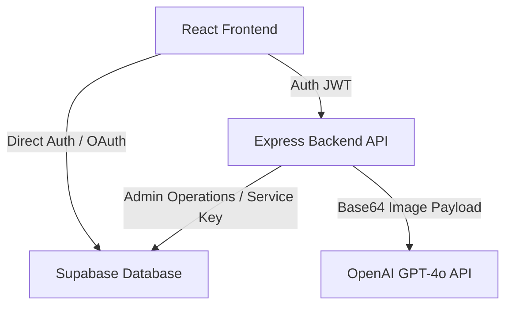
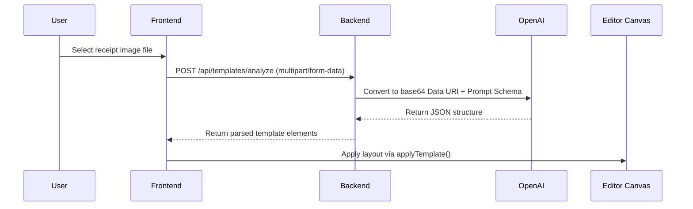

# LedgerX — Complete Technical Documentation & Reference Guide

LedgerX is a premium receipt generator and template persistence system built with React, Express, and Supabase. The project utilizes Tailwind CSS and conforms to the **Nothing UI** design aesthetics: sharp 0px border-radii, monochrome palettes, striking red accents, and monospace JetBrains Mono fonts for financial fields.

---

## 1. System Architecture Overview

LedgerX is structured as a split-pane client-server application:



### Components Summary
1. **Template Gallery & Deck Studio**: The central hub for browsing existing saved templates, launching the creation wizard, importing layouts from images via AI, or deleting templates.
2. **Template Wizard**: A multi-step structured setup tool enabling users to define presets, headers, customer info segments, body grids, total styling rules, and footer formats without writing JSON.
3. **Canvas Template Editor**: A visual designer equipped with mouse drag-and-resize manipulation (`react-moveable`), z-order adjustments, background color selectors, and persistence hooks.
4. **Receipt Generation Preview**: A split-pane layout featuring an automatically generated input form in the left pane (based on the dynamic elements of the loaded template) and a pixel-perfect, live-rendering receipt mockup in the right pane.
5. **Sales Dashboard**: An interactive ledger displaying all exported receipts using `ag-grid-react`. Features `ag-theme-quartz` synchronized with the global dark/light theme, robust data flattening, and dynamic auto-sizing columns.

---

## 2. Database Schema & Persistence

All records are persisted to a PostgreSQL database hosted on Supabase. Row Level Security (RLS) is enabled on all tables to enforce owner-scoped access.

### 2.1 Templates Table
Stores the structural layout configuration of templates.

```sql
CREATE TABLE public.templates (
  id UUID PRIMARY KEY DEFAULT gen_random_uuid(),
  user_id UUID NOT NULL REFERENCES auth.users(id) ON DELETE CASCADE,
  name TEXT NOT NULL DEFAULT 'Untitled Template',
  schema_json JSONB NOT NULL,
  created_at TIMESTAMP WITH TIME ZONE DEFAULT NOW(),
  updated_at TIMESTAMP WITH TIME ZONE DEFAULT NOW()
);

-- Index for user retrieval and sorting
CREATE INDEX idx_templates_user_id ON public.templates(user_id);
CREATE INDEX idx_templates_created_at ON public.templates(created_at DESC);
```

### 2.2 Receipts Table
Stores snapshots of form data submitted during exports.

```sql
CREATE TABLE public.receipts (
  id UUID PRIMARY KEY DEFAULT gen_random_uuid(),
  user_id UUID NOT NULL REFERENCES auth.users(id) ON DELETE CASCADE,
  template_id UUID REFERENCES public.templates(id) ON DELETE SET NULL,
  form_data JSONB NOT NULL DEFAULT '{}'::jsonb,
  created_at TIMESTAMP WITH TIME ZONE DEFAULT NOW()
);

-- Performance Indexes
CREATE INDEX idx_receipts_user_id ON public.receipts(user_id);
CREATE INDEX idx_receipts_template_id ON public.receipts(template_id);
CREATE INDEX idx_receipts_created_at ON public.receipts(created_at DESC);
```

---

## 3. Standard JSON Template Schema

All templates follow the standard schema defined in [templateSchema.js](file:///c:/Users/kosan/ZCodeProject/RG/client/src/lib/templateSchema.js). The conversion functions `convertToStandardSchema` and `convertFromStandardSchema` translate layout variables to and from the internal legacy representation while preserving canvas width and height.

### 3.1 Main Container Schema
```json
{
  "width": 380,
  "height": 620,
  "backgroundColor": "#ffffff",
  "elements": []
}
```

### 3.2 Element Types

#### Text Element (`type: "text"`)
Renders formatted labels or fields.
```json
{
  "id": "business_name",
  "type": "text",
  "content": "LedgerX Corp",
  "x": 0,
  "y": 45,
  "width": 380,
  "height": 30,
  "rotation": 0,
  "zIndex": 2,
  "fontFamily": "Inter, sans-serif",
  "fontSize": 20,
  "fontWeight": 700,
  "color": "#000000",
  "textAlign": "center",
  "lineHeight": 1.3,
  "letterSpacing": 0.5,
  "isDynamic": false
}
```

#### Table Element (`type: "table"`)
Renders line-item grids with custom styles and computed totals.
```json
{
  "id": "items_table",
  "type": "table",
  "content": "[]",
  "x": 20,
  "y": 280,
  "width": 340,
  "height": 120,
  "isDynamic": true,
  "fieldKey": "line_items",
  "columns": [
    { "key": "no", "label": "NO", "width": 10, "textAlign": "left" },
    { "key": "desc", "label": "ITEM", "width": 50, "textAlign": "left" },
    { "key": "qty", "label": "QTY", "width": 20, "textAlign": "right" },
    { "key": "price", "label": "AMT", "width": 20, "textAlign": "right" }
  ],
  "tableStyle": "grid",
  "totalStyle": "solid-bar",
  "totalFieldKey": "total_amount"
}
```

#### Shape Element (`type: "shape"`)
Renders borders, lines, or circular stamps.
```json
{
  "id": "stamp_circle",
  "type": "shape",
  "shapeType": "circle-stamp",
  "x": 250,
  "y": 480,
  "width": 80,
  "height": 80,
  "color": "#FF3355",
  "content": "PAID"
}
```

#### Image Element (`type: "image"`)
Renders visual graphics or logos.
```json
{
  "id": "logo_img",
  "type": "image",
  "content": "data:image/png;base64,...",
  "shape": "circle",
  "x": 160,
  "y": 10,
  "width": 60,
  "height": 60
}
```

#### Barcode & QRCode Elements (`type: "barcode" | "qrcode"`)
Renders visual data patterns.
```json
{
  "id": "receipt_qrcode",
  "type": "qrcode",
  "content": "https://ledgerx.io/verify/123",
  "x": 140,
  "y": 510,
  "width": 100,
  "height": 100
}
```

---

## 4. Layout Rendering System (`TemplateRenderer.jsx`)

The layout rendering engine [TemplateRenderer.jsx](file:///c:/Users/kosan/ZCodeProject/RG/client/src/components/TemplateRenderer.jsx) maps positioned elements onto a relative layout container.

### 4.1 Dynamic Canvas Height Expansion
When table rows multiply, they might overflow the initial canvas boundary. The renderer prevents visual overlaps by pushing trailing elements downwards:

$$\text{Table Extra Height} = \max(0, \text{Actual Content Height} - \text{Designed Table Height})$$

Where:
- $\text{Actual Content Height} = \text{Total Rows} \times \text{Row Height}$
- $\text{Total Rows} = \text{Header Row} + \max(1, \text{Item Rows}) + \text{Total Row (if shown)}$

Elements positioned below the table are adjusted using:

$$y_{\text{adjusted}} = y_{\text{designed}} + \sum_{\text{Tables above element}} \text{Table Extra Height}$$

The canvas height expands dynamically to accommodate this shift:

$$H_{\text{canvas}} = \max(H_{\text{designed}}, \max_{i} (y_{i, \text{adjusted}} + \text{height}_{i}))$$

### 4.2 Table and Total Styling Schemes
Six distinct visual configurations are supported:

| Style Name | Table Border Format | Total Section Rendering |
| :--- | :--- | :--- |
| `none` | No border lines | Total row is hidden |
| `grid` | Full outline, column, and row dividers | Total box integrated in grid with bold borders |
| `minimal` | Single line under headers and items | Double thin borders above and below the total row |
| `zebra` | Alternating row backgrounds | Subtle fill matching secondary colors |
| `compact-list` | Dotted line boundaries | Mono spacing, right-aligned total with no borders |
| `ledger-double` | Triple border dividers | Double-underlined values (accounting format) |
| `boxed-total` | Sharp outer borders | Bold text enclosed in a heavy solid boundary |

> **Note on Legacy Tables**: Users can dynamically switch these formats inside the **Deck Studio Properties Panel** via the *Table Style*, *Show Total Row*, and *Total Style* dropdowns. Unstyled legacy tables imported before these features were added will gracefully default to `'none'` to prevent unintended red grid formatting.

---

## 5. Screen Views and Editor Forms

### 5.1 Template Studio Wizard
Users navigate a 6-step builder in [TemplateWizard.jsx](file:///c:/Users/kosan/ZCodeProject/RG/client/src/components/deck/TemplateWizard.jsx):
1. **Format Selector**: Chooses a preset width and height.
2. **Header Configuration**: Adds a logo, alignments, description text.
3. **Customer Details Layout**: Sets up buyer fields:
   - *None* (skip).
   - *Customer Name* only (1 field).
   - *Full Details* (Name, Address, Phone).
   - *Compact* (Name, Phone side-by-side).
4. **Body Styling**: Selects table formats.
5. **Total Block Styling**: Stylizes the total row independently from the table body.
6. **Footer Layout**: Configures double-line rules, legal text boxes, and barcode modules.

### 5.2 Receipt Generator Preview Screen
The [ReceiptPreviewNew.jsx](file:///c:/Users/kosan/ZCodeProject/RG/client/src/components/ReceiptPreviewNew.jsx) screen renders:
- **Left Input Form**: Generates form inputs for elements with `isDynamic: true`. Group items inside a repeater widget for the table elements. Form fields style uses monospace fonts for data entry.
- **Right Preview Panel**: Draws the template dynamically resized to `activeTemplate.width` (e.g. 300px or 380px) ensuring a pixel-perfect preview matching the final exported PNG file.
- **Save Pipeline**: Exports high-resolution receipt PNG files via `html2canvas` (scale: 2) while simultaneously making a `POST` request to `/api/receipts` to register the record in the ledger.

---

## 6. Sales Dashboard Ledger & Robustness

The [SalesDashboard.jsx](file:///c:/Users/kosan/ZCodeProject/RG/client/src/components/SalesDashboard.jsx) renders the receipts history. It employs robust parsing and formatting logic:

```javascript
const safeParseFormData = (data) => {
  if (!data) return {};
  if (typeof data === 'object') return data;
  if (typeof data === 'string') {
    try {
      const parsed = JSON.parse(data);
      if (typeof parsed === 'string') return JSON.parse(parsed) || {};
      return parsed || {};
    } catch (e) {
      return {};
    }
  }
  return {};
};
```

This flattened structure is rendered inside a custom skinned, sharp-edged `ag-grid-react` grid featuring theme rules matching Nothing UI styles. 
- **Theme Synchronization**: A `MutationObserver` watches the `data-theme` attribute on the `<html>` element, seamlessly switching the grid between `ag-theme-quartz` and `ag-theme-quartz-dark`.
- **Robust formatting**: `total_amount` fields are defensively parsed and styled via `Intl.NumberFormat`. Empty states and network errors are explicitly presented in the UI to prevent hanging skeletons.

---

## 7. AI Layout Generation Engine

The `/api/templates/analyze` route accepts uploaded receipt images and leverages GPT-4o to construct a digital layout.



The server configuration extracts coordinates to align text elements, table boundaries, and logo dimensions in a standard JSON format ready to be saved. The `ImportImageButton` then assigns the specific `width` and dynamically calculated `height` inferred by the GPT-4o parser to prevent content from falling outside the canvas layout.
